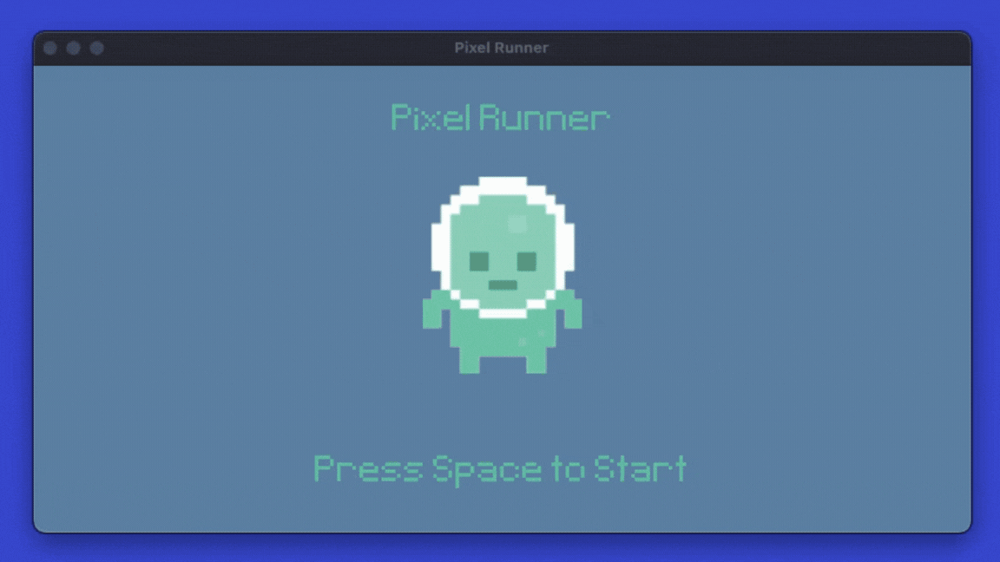

# Pixel Runner

### About the Project
Pixel Runner is a simple 2D game built using Python3 and Pygame. It was built to understand the basics of the Pygame library and the foundations of 2D game mechanics. It features an animated character that is able to jump over "enemies" coming toward it. If the player fails to jump over an enemy, or in any way collides with an enemy, the game ends and display's the player's score. While exploring the Pygame concepts of surfaces, rects, animation, and collision, this project also provided an excellent opportunity to futher explore object-oriented programming concepts, and the use of Python classes. Enjoy!

